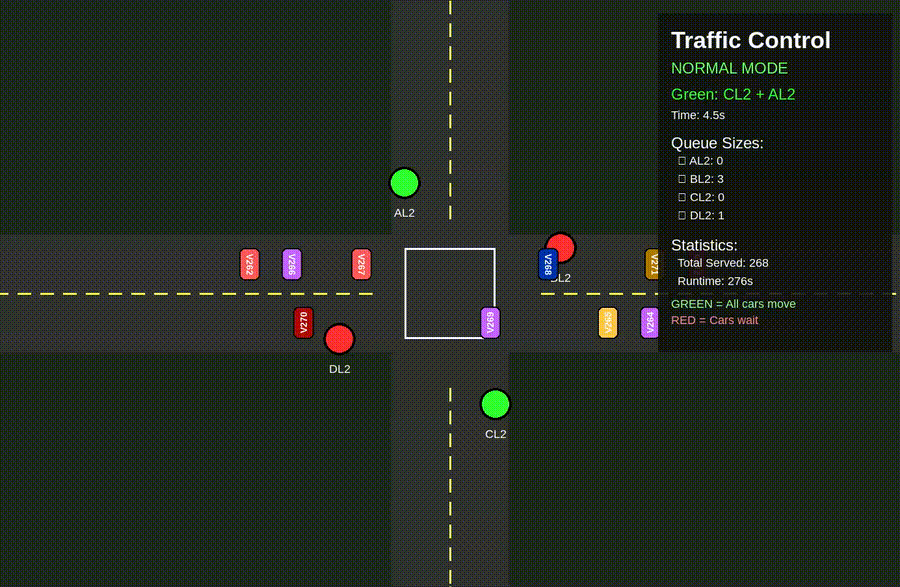

# Traffic Junction Simulation - DSA Queue Implementation

**Course:** COMP202 - Data Structures and Algorithms  
**Student:** Tadillata Bhandari  
**Assignment:** #1 - Queue-Based Traffic Light Management  

---

## 📋 Project Summary

This project implements a **real-time traffic junction simulation** using **Queue** and **Priority Queue** data structures. The simulation manages traffic flow across a 4-road intersection with automatic vehicle generation, priority lane handling, and visual display using Pygame.

---

## 🎬 Demo Video

<p align="center">
  
</p>

---

## 🏗️ Project Structure

```
dsa-queue-simulator/
│
├── src/                          # Source package
│   ├── __init__.py              # Package initialization
│   ├── queue.py                 # Queue data structure (FIFO)
│   ├── priority_queue.py        # Priority Queue implementation
│   ├── vehicle.py               # Vehicle class with metadata
│   ├── traffic_light.py         # Traffic light state management
│   ├── traffic_generator.py     # Random vehicle generation
│   └── simulation.py            # Main simulation logic & Pygame
│
├── run.py                       # Program entry point
├── README.md                     # This documentation
├── .gitignore                    # Git ignore rules
│
└── media/                        # Demo materials (optional)
    └── demo.gif                 # Recorded demonstration
```

---

## 🚀 How to Run

### Prerequisites
```bash
# Python 3.7 or higher
python --version

# Install Pygame
pip install pygame
```

### Running the Simulation
```bash
# Navigate to project folder
cd dsa-queue-simulator

# Run the simulation
python3 run.py
```

### Expected Behavior
1. Pygame window opens 
2. Traffic intersection displayed
3. Vehicles start appearing (1 per second)
4. Traffic lights cycle automatically
5. Priority mode activates when AL2 > 10 vehicles

### Controls
- **ESC** - Quit simulation
- **Close Window** - Exit program

---

## 📊 Data Structures

### 1. Queue (src/queue.py)

**Purpose:** Manage vehicles in FIFO order for each lane

**Implementation:**
```python
class Queue:
    - enqueue(item)    # Add to rear - O(1)
    - dequeue()        # Remove from front - O(n)
    - size()           # Get size - O(1)
    - is_empty()       # Check if empty - O(1)
    - front()          # Peek at front - O(1)
```

**Usage:** Each lane (AL2, BL2, CL2, DL2) has its own queue storing waiting vehicles.

### 2. Priority Queue (src/priority_queue.py)

**Purpose:** Determine which lane gets green light next

**Implementation:**
```python
class PriorityQueue:
    - enqueue(data, priority)         # Add with priority - O(n)
    - dequeue()                       # Remove highest - O(1)
    - update_priority(data, new_p)    # Change priority - O(n)
```

**Usage:** Manages lane scheduling. AL2 gets priority 0 (highest) when congested, others have priority 1.

### 3. Vehicle (src/vehicle.py)

**Purpose:** Store individual vehicle data

**Attributes:**
- `id` - Unique identifier
- `lane` - Current lane (AL2, BL2, etc.)
- `arrival_time` - When vehicle arrived
- `wait_time` - Time spent waiting

---

## 🚦 Traffic Light Algorithm

### Normal Mode Operation

**Rules:**
1. Opposite roads get green together (A+C or B+D)
2. Each pair gets 5 seconds of green time
3. Vehicles served = average of (BL2 + CL2 + DL2) / 3
4. Cycle: A+C → B+D → A+C → ...

**Formula:**
```
vehicles_to_serve = max(1, (BL2_size + CL2_size + DL2_size) / 3)
```

### Priority Mode Operation

**Activation:** When AL2 queue > 10 vehicles

**Behavior:**
- AL2 gets exclusive green light
- All other lanes stay red
- ALL vehicles in AL2 are served
- Continues until AL2 < 5 vehicles

**Deactivation:** When AL2 queue < 5 vehicles, returns to normal mode

### Pseudocode

```
INITIALIZATION:
    Create 4 vehicle queues (AL2, BL2, CL2, DL2)
    Create priority queue for lanes
    Set all lanes to priority = 1
    Start with A+C green

MAIN LOOP (every frame):
    1. Generate vehicle (every 1 second)
       - 35% chance → AL2
       - 65% chance → BL2, CL2, or DL2
    
    2. Check priority status
       IF AL2.size() > 10 AND not priority_mode:
           priority_mode = TRUE
           AL2.priority = 0
       ELSE IF AL2.size() < 5 AND priority_mode:
           priority_mode = FALSE
           AL2.priority = 1
    
    3. Update traffic lights (every 5 seconds)
       IF priority_mode:
           GREEN: AL2 only
           RED: BL2, CL2, DL2
       ELSE:
           current_pair = lane_queue.front()
           opposite = get_opposite(current_pair)
           GREEN: current_pair + opposite
           RED: others
    
    4. Move vehicles
       FOR each lane:
           IF light is GREEN:
               ALL vehicles move continuously
               Remove vehicles that passed through
           ELSE:
               Vehicles wait in queue
    
    5. Update statistics
       Count served vehicles
       Track wait times

END LOOP
```

---

## ⏱️ Time Complexity Analysis

### Data Structure Operations

| Operation | Time Complexity | Explanation |
|-----------|----------------|-------------|
| Queue.enqueue() | **O(1)** | Append to list end |
| Queue.dequeue() | **O(n)** | Remove from front, shifts array |
| Queue.size() | **O(1)** | Return list length |
| PriorityQueue.enqueue() | **O(n)** | Find insertion position |
| PriorityQueue.dequeue() | **O(1)** | Remove from front |
| PriorityQueue.update_priority() | **O(n)** | Remove + re-insert |

### Simulation Operations

| Operation | Complexity | Per Frame |
|-----------|-----------|-----------|
| Generate vehicle | O(1) | Once per second |
| Check priority | O(1) | Every frame |
| Update vehicles | O(v) | v = visible vehicles |
| Render graphics | O(v + c) | v = vehicles, c = UI components |

**Overall per frame:** O(v) where v is the number of visible vehicles

**Optimization Opportunity:** Using `collections.deque` would make dequeue() O(1) instead of O(n)

---


### Sample Output

```
============================================================
Final Statistics
============================================================
Total Served: 156
Runtime: 180s

AL2: 45 served, avg wait 8.5s
BL2: 38 served, avg wait 12.3s
CL2: 36 served, avg wait 11.8s
DL2: 37 served, avg wait 10.9s
============================================================
```

---


### Movement Logic
```python
# Green light: ALL vehicles move
if is_green:
    target = exit_position
    move_continuously()

# Red light: Vehicles wait
else:
    target = queue_position
    stay_in_place()
```

### Priority Queue Management
```python
# Normal: All lanes equal priority
for lane in lanes:
    priority_queue.enqueue(lane, priority=1)

# Priority: AL2 highest
priority_queue.update_priority("AL2", priority=0)
```


---

**Thank you for reviewing this project!** 🚀
